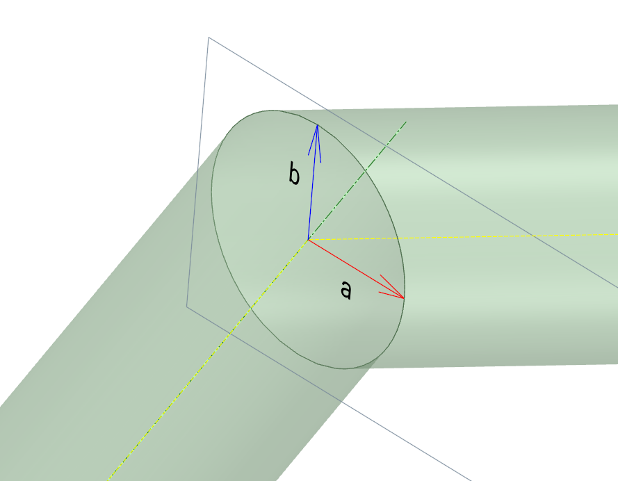

# Intersection of two infinite cylinders

## Problem Definition

Consider two line segments hat are joined at a common node located at $\boldsymbol{p}$. Each line segment has (unit) direction vector $\boldsymbol{e}_1$ and $\boldsymbol{e}_2$ and define the axis of an infinite cylinder each with radius $R$.

Describe the ellipse defined as the intersection of the two cylinders. The ellipse will have center most likely at $\boldsymbol{p}$ and semi-major axis defined by some vector $\boldsymbol{a}$, and semi-minor axis by a vector $\boldsymbol{b}$.

## Solution

### Approach

The approach here is to define the plane where the ellipse resides. This plane bisects the angle between the two line segments and acts like a mirror between the two cylinders.

### Mirror Plane Definition

The ellipse and the plane that contains it also contains the semi-minor vector $b$ which is also the common normal between the two lines, at least in direction

$$
\boldsymbol{b} = \lambda\, ( \boldsymbol{e}_1 \times \boldsymbol{e}_2 )
$$

Additionally, the direction of semi-major axis $\boldsymbol{a}$ is defined by the bisector of the two line segment directions

$$
\boldsymbol{a} = \kappa\, ( \frac{ \boldsymbol{e}_1 + \boldsymbol{e}_2 }{2} )
$$

### Ellipse Definition

To find the coefficients $\lambda$ and $\kappa$ we must enforce that distance $R$ between the all the points on the ellipse and the two infinite lines through the cylinder axis.

Define the point on the first axis that is closest to the the semi-major axis of the ellipse

$$
\boldsymbol{g}_1 = \boldsymbol{p} + (\boldsymbol{e}_1 \cdot \boldsymbol{a}) \boldsymbol{e}_1
$$

and on the point on the second line also closest to the semi-major axis of the ellipse

$$
\boldsymbol{g}_2 = \boldsymbol{p} + (\boldsymbol{e}_2 \cdot \boldsymbol{a}) \boldsymbol{e}_2
$$

The trick is to set the distance between the axis and where $\boldsymbol{a}$ ends as $R$

$$
\begin{aligned}
R & = \| \boldsymbol{p} + \boldsymbol{a} - \boldsymbol{g}_1 \| \\
 & = \| \boldsymbol{a}  - \boldsymbol{e}_1  ( \boldsymbol{e}_1 \cdot \boldsymbol{a}) \| \\
& = \|  \kappa\, ( \frac{ \boldsymbol{e}_1 + \boldsymbol{e}_2 }{2} )  - \boldsymbol{e}_1  ( \boldsymbol{e}_1 \cdot \kappa\, ( \frac{ \boldsymbol{e}_1 + \boldsymbol{e}_2 }{2} )) \| \\
& = \frac{\kappa}{2}\|\boldsymbol{e}_{2}-\boldsymbol{e}_{1}(\boldsymbol{e}_{1}\cdot\boldsymbol{e}_{2}))\|
\end{aligned}
$$

similarly for the other axis

$$
\begin{aligned}
R&=\|\boldsymbol{p}+\boldsymbol{a}-\boldsymbol{g}_{2}\|\\&=\|\boldsymbol{a}-\boldsymbol{e}_{2}(\boldsymbol{e}_{2}\cdot\boldsymbol{a})\|\\&=\|\kappa\,(\frac{\boldsymbol{e}_{1}+\boldsymbol{e}_{2}}{2})-\boldsymbol{e}_{2}(\boldsymbol{e}_{2}\cdot\kappa\,(\frac{\boldsymbol{e}_{1}+\boldsymbol{e}_{2}}{2}))\|\\&=\frac{\kappa}{2}\|\boldsymbol{e}_{1}-\boldsymbol{e}_{2}(\boldsymbol{e}_{2}\cdot\boldsymbol{e}_{1})\|
\end{aligned}
$$

The result is the same for both axis. The value of $\kappa$ is

$$
\kappa = \frac{2 R}{\boldsymbol{e}_{2}-\boldsymbol{e}_{1}(\boldsymbol{e}_{1}\cdot\boldsymbol{e}_{2}))}
$$

The last piece of the puzzle is the semi-minor axis $\boldsymbol{b}$ which is perpendicult to both cylinders and thus also must be at a distance $R$ from the axis.

$$
\begin{aligned}
R & = \| \boldsymbol{b} \| \\
 & = \| \lambda ( \boldsymbol{e}_1 \times \boldsymbol{e}_2 ) \| \\
& = \lambda \| \boldsymbol{e}_1 \times \boldsymbol{e}_2 \|
\end{aligned}
$$

The results is

$$
\lambda = \frac{R}{ \| \boldsymbol{e}_1 \times \boldsymbol{e}_2 \|}
$$

### Summary

So in summary the intesecting ellipse is defined by the following properties

| quantity | definition |
| -: | :- |
| Origin | $\boldsymbol{p}$ |
| Semi-major axis | $\boldsymbol{a} = \frac{\boldsymbol{e}_1 + \boldsymbol{e}_2 }{\boldsymbol{e}_{2}-\boldsymbol{e}_{1}(\boldsymbol{e}_{1}\cdot\boldsymbol{e}_{2}))} R $ |
| Semi-minor axis | $\boldsymbol{b} =\frac{\boldsymbol{e}_1 \times \boldsymbol{e}_2}{ \| \boldsymbol{e}_1 \times \boldsymbol{e}_2 \|} R $ |

